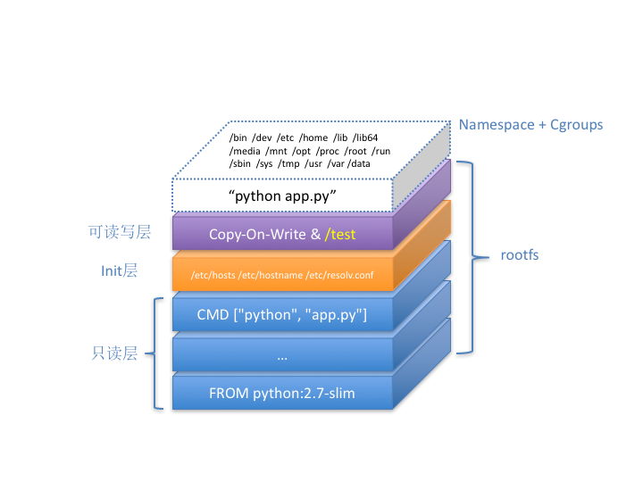

# docker原理

* docker原理主要搞清楚三个东西：namespace/cgroup/rootfs

1. namespace:主要用于资源隔离，就是模拟出一个空间，但底层的核心的东西还是宿主机的。
2. cgroup:主要用于资源限制，主要是限制容器对内存/cpu之类的资源的限制。上面两者一起称为动态空间。
3. rootfs:作为基础设施层，每次新添加的都是都会在上面新添一层。又称静态空间
