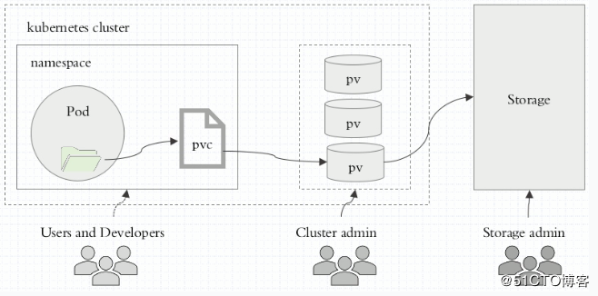

# Kubernetes各类存储卷

- 常见分类
   * emptyDir（临时目录）:Pod删除，数据也会被清除，这种存储成为emptyDir，用于数据的临时存储。
   * hostPath (宿主机目录映射):
   * 本地的SAN (iSCSI,FC)、NAS(nfs,cifs,http)存储
   * 分布式存储（glusterfs，rbd，cephfs）
   * 云存储（EBS，Azure Disk）

- k8s存储卷使用步骤
   1. 在pod定义volume，并指明关联到哪个存储设备
   2. 在容器使用volume mount进行挂载


- pv-pvc示意图


生命周期：Provisioning（配置）—> Binding（绑定）—>Using（使用）—> Releasing（释放） —> Recycling（回收）

    > PV又分为静态PV和动态PV。静态就是直接指定pv、pvc，动态是自动生成。


- 扩容操作
    - 修改PVC的size，命令行使用kubectl edit pvc xxx，直接修改PVC的容量即可。
```
apiVersion: v1
kind: PersistentVolumeClaim
metadata:
  annotations:
    volume.beta.kubernetes.io/storage-provisioner: ceph.com/rbd
  name: resize
spec:
  resources:
    requests:
      storage: 5Gi
  storageClassName: sata
```
之后PVC会进入 FileSystemResizePending 状态，等待Pod重启。
```
apiVersion: v1
kind: PersistentVolumeClaim
metadata:
  annotations:
    volume.beta.kubernetes.io/storage-provisioner: ceph.com/rbd
  name: resize
spec:
  resources:
    requests:
      storage: 6Gi
  storageClassName: sata
status:
  accessModes:
  - ReadWriteOnce
  capacity:
    storage: 5Gi
  conditions:
  - lastProbeTime: null
    lastTransitionTime: 2019-04-14T03:51:36Z
    message: Waiting for user to (re-)start a pod to finish file system resize of
      volume on node.
    status: "True"
    type: FileSystemResizePending
  phase: Bound
```
- 重启挂载该PVC的Pod，之后，controller manager 会调用 resize命令，更新image的大小，并重新挂载卷到Pod上去
