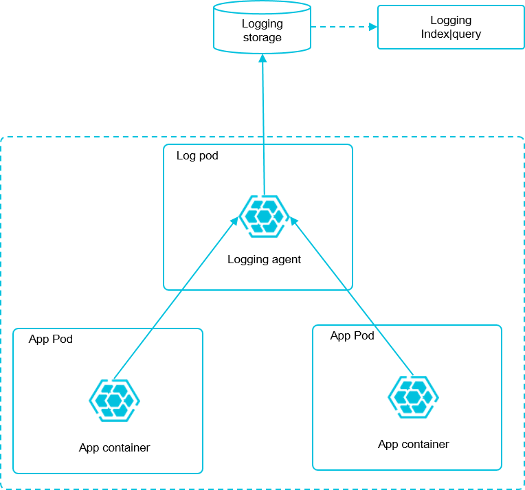

# Kubernetes日志收集方案：Log-Pilot+Elasticsearch+Kibana



* 原理
    > 通过DaemonSet的方式把Log-Pilot部署到每个集群的Node节点上，它不仅能够高效便捷地将容器日志采集输出到多种存储日志后端，同时还能够动态地发现和采集容器内部的日志文件。

* 范例
```
$ cat log-pilot.yml
---
apiVersion: extensions/v1beta1
kind: DaemonSet
metadata:
  name: log-pilot
  namespace: kube-system
  labels:
    k8s-app: log-pilot
    kubernetes.io/cluster-service: "true"
spec:
  template:
    metadata:
      labels:
        k8s-app: log-es
        kubernetes.io/cluster-service: "true"
        version: v1.22
    spec:
      tolerations:
      - key: node-role.kubernetes.io/master
        effect: NoSchedule
      serviceAccountName: admin
      containers:
      - name: log-pilot
        image: registry.cn-hangzhou.aliyuncs.com/acs-sample/log-pilot:0.9-filebeat
        resources:
          limits:
            memory: 200Mi
          requests:
            cpu: 100m
            memory: 200Mi
        env:
          - name: "FILEBEAT_OUTPUT"
            value: "elasticsearch"
          - name: "ELASTICSEARCH_HOST"
            value: "elasticsearch-api"
          - name: "ELASTICSEARCH_PORT"
            value: "9200"
          - name: "ELASTICSEARCH_USER"
            value: "elastic"
          - name: "ELASTICSEARCH_PASSWORD"
            value: "changeme"
        volumeMounts:
        - name: sock
          mountPath: /var/run/docker.sock
        - name: root
          mountPath: /host
          readOnly: true
        - name: varlib
          mountPath: /var/lib/filebeat
        - name: varlog
          mountPath: /var/log/filebeat
        securityContext:
          capabilities:
            add:
            - SYS_ADMIN
      terminationGracePeriodSeconds: 30
      volumes:
      - name: sock
        hostPath:
          path: /var/run/docker.sock
      - name: root
        hostPath:
          path: /
      - name: varlib
        hostPath:
          path: /var/lib/filebeat
          type: DirectoryOrCreate
      - name: varlog
        hostPath:
          path: /var/log/filebeat
          type: DirectoryOrCreate


```

* 生产模板

```
$ cat log-polit.yaml
apiVersion: extensions/v1beta1
kind: DaemonSet
metadata:
  name: log-pilot
  labels:
    app: log-pilot
  # 设置期望部署的namespace
  namespace: kube-system
spec:
  updateStrategy:
    type: RollingUpdate
  template:
    metadata:
      labels:
        app: log-pilot
      annotations:
        scheduler.alpha.kubernetes.io/critical-pod: ''
    spec:
      # 是否允许部署到Master节点上
#      tolerations:
#      - key: node-role.kubernetes.io/master
#        effect: NoSchedule
      containers:
      - name: log-pilot
        # 版本请参考https://github.com/AliyunContainerService/log-pilot/releases
        image: 172.16.1.200:5000/logpolit:20190808
        resources:
          limits:
            memory: 500Mi
          requests:
            cpu: 200m
            memory: 200Mi
        env:
          - name: "NODE_NAME"
            valueFrom:
              fieldRef:
                fieldPath: spec.nodeName
          - name: "LOGGING_OUTPUT"
            value: "elasticsearch"
          # 请确保集群到ES网络可达
          - name: "ELASTICSEARCH_HOSTS"
            value: "172.16.1.200:9200"
        volumeMounts:
        - name: sock
          mountPath: /var/run/docker.sock
        - name: root
          mountPath: /host
          readOnly: true
        - name: varlib
          mountPath: /var/lib/filebeat
        - name: varlog
          mountPath: /var/log/filebeat
        - name: localtime
          mountPath: /etc/localtime
          readOnly: true
        livenessProbe:
          failureThreshold: 3
          exec:
            command:
            - /pilot/healthz
          initialDelaySeconds: 10
          periodSeconds: 10
          successThreshold: 1
          timeoutSeconds: 2
        securityContext:
          capabilities:
            add:
            - SYS_ADMIN
      terminationGracePeriodSeconds: 30
      volumes:
      - name: sock
        hostPath:
          path: /var/run/docker.sock
      - name: root
        hostPath:
          path: /
      - name: varlib
        hostPath:
          path: /var/lib/filebeat
          type: DirectoryOrCreate
      - name: varlog
        hostPath:
          path: /var/log/filebeat
          type: DirectoryOrCreate
      - name: localtime
        hostPath:
          path: /etc/localtime


$ cat ./api-admin.yaml
apiVersion: extensions/v1beta1
kind: Deployment
metadata:
  name: api-admin
  namespace: t3
spec:
  replicas: 1
  template:
    metadata:
      labels:
        app: api-admin
        track: stable
    spec:
      containers:
      - name: api-admin
        image: 172.16.1.200:5000/api-admin:dev_2019-08-15-16-21-21
        volumeMounts:
        - name: time
          mountPath: /etc/localtime
        env:
        - name: aliyun_logs_admint4
          value: "stdout"    		  
        ports:
          - containerPort: 8080
      nodeSelector:
        node: "mwteck202"
      volumes:
      - name: time
        hostPath:
          path: /etc/localtime	  

---

apiVersion: v1
kind: Service
metadata:
  name: api-admin
  namespace: t3
spec:
  type: NodePort
  ports:
  - port: 8080
    targetPort: 8080
    nodePort: 30212
  selector:
    app: api-admin


```
