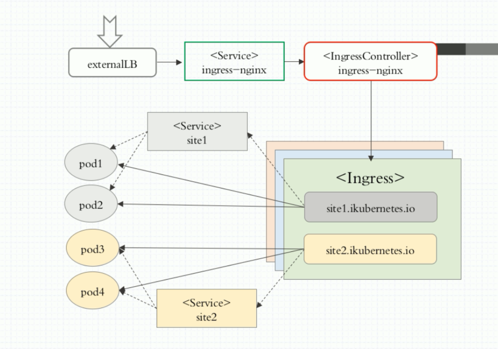

# kubernetes ingress参考范例


```
组件说明
externalLB : 外部的4层负载均衡器
<Service> ingress-nginx : nodePort 类型的 service 为 <IngressController> ingress-nginx 的 pod 接入外部流量
<IngressController> ingress-nginx : ingress-nginx pod, 负责创建负载均衡
<Ingress> : Ingress 根据后端 Service 实时识别分类及 IP 把结果生成配置文件注入到 ingress-nginx pod 中
<Service> site1 : Service 对后端的pod 进行分类(只起分类作用)
```

```
https://github.com/kubernetes/ingress-nginx/blob/nginx-0.17.0/deploy/mandatory.yaml
把上面页面的yaml文件弄回本地执行，确保nginx-ingress-controller起来了。
[root@node2 ingress]# kubectl get pods -n ingress-nginx |grep nginx-ingress-controller
nginx-ingress-controller-5784c99d57-vpgp7   1/1     Running            0          15m


然后根据自己的具体业务写,暴露端口方便访问
$ cat nginx-ingress-service.yaml
apiVersion: v1
kind: Service
metadata:
  name: nginx-ingress-controller
  namespace: ingress-nginx
spec:      
  type: NodePort
  ports:
    - port: 80
      name: http
      nodePort: 30080
    - port: 443
      name: https
      nodePort: 30443
  selector:
    app: ingress-nginx


# 通过url转发到指定的项目
$ cat tomcat-ingress.yaml
apiVersion: extensions/v1beta1
kind: Ingress
metadata:
  name: tomcat-ingress
  namespace: dev
  annotations:
    kubernetes.io/ingress.class: "nginx"
    nginx.ingress.kubernetes.io/configuration-snippet: |　　
      rewrite /api-admin/(.*)  /$1  break;
spec:
  rules:
  - host: dev.lift360.cn
    http:
      paths:
      - path: /api-admin
        backend:
          serviceName: api-admin
          servicePort: 8080

```
