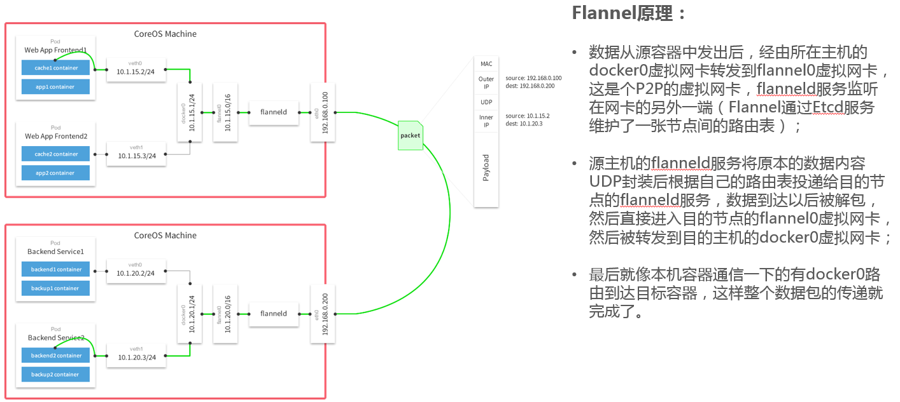
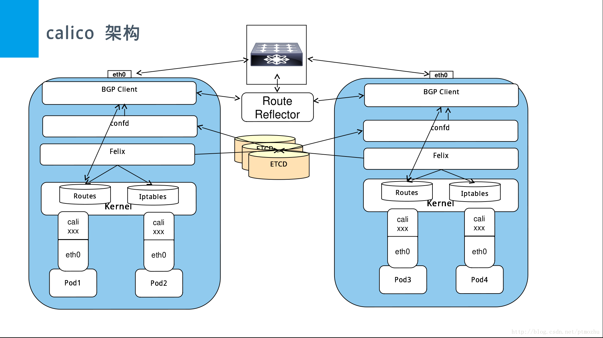

# 简述calico、flannel的区别


## flannel概述

```
１、flannel在报文的传播过程中有封包拆包的过程，损耗了网络但安全性更佳
２、适用于不在一个网络的机器，可以通过etcd来跨网络连接到各个主机
３、宿主机上每个容器则从IP段中分配得到1个虚拟IP。
```


## calico概述

```
１、calico 走bgp协议
２、是直接发包没有拆封的过程，传播的更快，但网络安全性是隐患
３、每台机子都有一个客户端，能根据iptables规则进行路由转发，直接从各个位置路由到指定的主机
４、每台宿主机上都有网络插件的agent进程，它们连接到etcd集中式存储，从虚拟IP池中申请一个IP段占位己有

```

### 主要方式的区别：
* 隧道方式、路由方式
1. 隧道方式：flannel vxlan和calico ipip模式都是隧道方案，但是calico的封装协议IPIP的header更小，所以性能比flannel vxlan要好一点点。
2. 路由方式：常见的路由方案包括了flannel的host-gw模式，以及calico的bgp模式，
