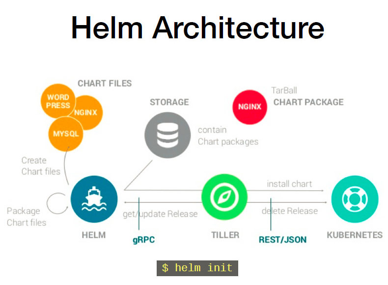

# Helm
    > Helm相当于linux操作系统里面的包管理器，提供了kubernetes上的软件部署，删除，升级，回滚应用的强大功能。

## 关键组件

* Helm
```
Helm 是一个命令行下的客户端工具。主要用于 Kubernetes 应用程序 Chart 的创建、打包、发布以及创建和管理本地和远程的 Chart 仓库。
```
* Tiller
```
Tiller 是 Helm 的服务端，部署在 Kubernetes 集群中。Tiller 用于接收 Helm 的请求，并根据 Chart 生成 Kubernetes 的部署文件（ Helm 称为 Release ），然后提交给 Kubernetes 创建应用。Tiller 还提供了 Release 的升级、删除、回滚等一系列功能。
```
* Chart
```
Helm 的软件包，采用 TAR 格式。类似于 APT 的 DEB 包或者 YUM 的 RPM 包，其包含了一组定义 Kubernetes 资源相关的 YAML 文件。
```
* Repoistory
```
Helm 的软件仓库，Repository 本质上是一个 Web 服务器，该服务器保存了一系列的 Chart 软件包以供用户下载，并且提供了一个该 Repository 的 Chart 包的清单文件以供查询。Helm 可以同时管理多个不同的 Repository。
```
* Release
```
使用 helm install 命令在 Kubernetes 集群中部署的 Chart 称为 Release。

```

## helm工作原理


* Chart Install 过程：
1. Helm从指定的目录或者tgz文件中解析出Chart结构信息
2. Helm将指定的Chart结构和Values信息通过gRPC传递给Tiller
3. Tiller根据Chart和Values生成一个Release
4. Tiller将Release发送给Kubernetes用于生成Release

* Chart Update过程：
1. Helm从指定的目录或者tgz文件中解析出Chart结构信息
2. Helm将要更新的Release的名称和Chart结构，Values信息传递给Tiller
3. Tiller生成Release并更新指定名称的Release的History
4. Tiller将Release发送给Kubernetes用于更新Release

* Chart Rollback过程：
1. Helm将要回滚的Release的名称传递给Tiller
2. Tiller根据Release的名称查找History
3. Tiller从History中获取上一个Release
4. Tiller将上一个Release发送给Kubernetes用于替换当前Release

## helm部署

* 一、Helm 客户端安装
```
Helm 的安装方式很多，这里采用二进制的方式安装。更多安装方法可以参考 Helm 的官方帮助文档。
```
方式一：使用官方提供的脚本一键安装
```
$ curl https://raw.githubusercontent.com/helm/helm/master/scripts/get > get_helm.sh
$ chmod 700 get_helm.sh
$ ./get_helm.sh
```
方式二：手动下载安装
```
#从官网下载最新版本的二进制安装包到本地：https://github.com/kubernetes/helm/releases
$ tar -zxvf helm-2.9.0.tar.gz # 解压压缩包
# 把 helm 指令放到bin目录下
$ mv helm-2.9.0/helm /usr/local/bin/helm
$ helm help # 验证
```

* Helm 服务端安装Tiller
Tiller 是以 Deployment 方式部署在 Kubernetes 集群中的，只需使用以下指令便可简单的完成安装。
```
$ helm init
```
由于 Helm 默认会去 storage.googleapis.com 拉取镜像，如果你当前执行的机器不能访问该域名的话可以使用以下命令来安装：
```
helm init --client-only --stable-repo-url https://aliacs-app-catalog.oss-cn-hangzhou.aliyuncs.com/charts/
helm repo add incubator https://aliacs-app-catalog.oss-cn-hangzhou.aliyuncs.com/charts-incubator/
helm repo update
```
```
# 创建服务端
helm init --service-account tiller --upgrade -i registry.cn-hangzhou.aliyuncs.com/google_containers/tiller:v2.9.1  --stable-repo-url https://kubernetes.oss-cn-hangzhou.aliyuncs.com/charts

# 创建TLS认证服务端，参考地址：https://github.com/gjmzj/kubeasz/blob/master/docs/guide/helm.md
helm init --service-account tiller --upgrade -i registry.cn-hangzhou.aliyuncs.com/google_containers/tiller:v2.9.1 --tiller-tls-cert /etc/kubernetes/ssl/tiller001.pem --tiller-tls-key /etc/kubernetes/ssl/tiller001-key.pem --tls-ca-cert /etc/kubernetes/ssl/ca.pem --tiller-namespace kube-system --stable-repo-url https://kubernetes.oss-cn-hangzhou.aliyuncs.com/charts
```

在 Kubernetes 中安装 Tiller 服务，因为官方的镜像因为某些原因无法拉取，使用-i指定自己的镜像，可选镜像：registry.cn-hangzhou.aliyuncs.com/google_containers/tiller:v2.9.1（阿里云），该镜像的版本与helm客户端的版本相同，使用helm version可查看helm客户端版本。

如果在用helm init安装tiller server时一直部署不成功,检查deployment，根据描述解决问题。

* 给 Tiller 授权

目前的 Tiller 部署时默认没有定义授权的 ServiceAccount，这会导致访问 API Server 时被拒绝。所以我们需要明确为 Tiller 部署添加授权。

创建 Kubernetes 的服务帐号和绑定角色

```
$ kubectl create serviceaccount --namespace kube-system tiller
$ kubectl create clusterrolebinding tiller-cluster-rule --clusterrole=cluster-admin --serviceaccount=kube-system:tiller

```

为 Tiller 设置帐号
```
# 使用 kubectl patch 更新 API 对象
$ kubectl patch deploy --namespace kube-system tiller-deploy -p '{"spec":{"template":{"spec":{"serviceAccount":"tiller"}}}}'
deployment.extensions "tiller-deploy" patched
```
查看是否授权成功
```
$ kubectl get deploy --namespace kube-system   tiller-deploy  --output yaml|grep  serviceAccount
serviceAccount: tiller
serviceAccountName: tiller
```
* 验证 Tiller 是否安装成功
```
$ kubectl -n kube-system get pods|grep tiller
tiller-deploy-6d68f5c78f-nql2z          1/1       Running   0          5m

$ helm version
Client: &version.Version{SemVer:"v2.9.1", GitCommit:"20adb27c7c5868466912eebdf6664e7390ebe710", GitTreeState:"clean"}
Server: &version.Version{SemVer:"v2.9.1", GitCommit:"20adb27c7c5868466912eebdf6664e7390ebe710", GitTreeState:"clean"}
```
* 卸载 Helm 服务器端 Tiller
如果你需要在 Kubernetes 中卸载已部署的 Tiller，可使用以下命令完成卸载。
```
$ helm reset 或
$helm reset --force
```
* Helm 使用
1）更换仓库：

若遇到Unable to get an update from the “stable” chart repository (https://kubernetes-charts.storage.googleapis.com) 错误
手动更换stable 存储库为阿里云的存储库
```
# 先移除原先的仓库
helm repo remove stable
# 添加新的仓库地址
helm repo add stable https://kubernetes.oss-cn-hangzhou.aliyuncs.com/charts
# 更新仓库
helm repo update
```
2）查看在存储库中可用的所有 Helm charts：
```
helm search

NAME                            CHART VERSION   APP VERSION     DESCRIPTION                                       
stable/acs-engine-autoscaler    2.1.3           2.1.1           Scales worker nodes within agent pools            
stable/aerospike                0.1.7           v3.14.1.2       A Helm chart for Aerospike in Kubernetes          
stable/anchore-engine           0.1.3           0.1.6           Anchore container analysis and policy evaluatio...
stable/artifactory              7.0.3           5.8.4           Universal Repository Manager supporting all maj...
stable/artifactory-ha           0.1.0           5.8.4           Universal Repository Manager supporting all maj...
stable/aws-cluster-autoscaler   0.3.2                           Scales worker nodes within autoscaling groups.
... ...
```
3）更新charts列表：
```
helm repo update
```
4）安装charts：

Monocular是一个开源软件，用于管理kubernetes上以Helm Charts形式创建的服务，可以通过它的web页面来安装helm Charts

安装Nginx Ingress controller，安装的k8s集群启用了RBAC，则一定要加rbac.create=true参数
```
helm install stable/nginx-ingress --set controller.hostNetwork=true，rbac.create=true
安装Monocular：

# 添加新的源
helm repo add monocular https://kubernetes-helm.github.io/monocular
# 安装
helm install monocular/monocular -f custom-repos.yaml

# custom-repos.yaml 内容
cat custom-repos.yaml

api:
  config:
    repos:
      - name: stable
        url: https://aliacs-app-catalog.oss-cn-hangzhou.aliyuncs.com/charts
        source: https://github.com/kubernetes/charts/tree/master/stable
      - name: incubator
        url: https://aliacs-app-catalog.oss-cn-hangzhou.aliyuncs.com/charts-incubator
        source: https://github.com/kubernetes/charts/tree/master/incubator
      - name: monocular
        url: https://kubernetes-helm.github.io/monocular
        source: https://github.com/kubernetes-helm/monocular/tree/master/charts
```
5）查看K8S中已安装的charts：
```
helm list

NAME                REVISION    UPDATED                     STATUS      CHART               NAMESPACE
amber-seal          1           Mon Jul  2 17:29:25 2018    DEPLOYED    nginx-ingress-0.9.5 default  
my-release          1           Mon Jul  2 15:19:44 2018    DEPLOYED    spark-0.1.10        default  
nonplussed-panther  1           Mon Jul  2 17:27:41 2018    FAILED      nginx-ingress-0.9.5 default  
turbulent-tuatara   1           Mon Jul  2 17:31:33 2018    DEPLOYED    monocular-0.6.2     default
```
6）删除安装的charts：
```
# 删除：helm delete xxx
helm delete amber-seal
```


* Chart 目录结构
```
$ helm create mongodb
Creating mongodb
$ tree mongodb/
mongodb/
├── charts                 # [可选]: 该目录中放置当前Chart依赖的其它Chart
├── Chart.yaml             # Yaml文件，用于描述Chart的基本信息，包括名称版本
├── templates              # [可选]: 部署文件模版目录，模版使用的值来自values.yaml和由Tiller提供的值
│   ├── deployment.yaml
│   ├── _helpers.tpl
│   ├── ingress.yaml
│   ├── NOTES.txt         # [可选]: 放置Chart的使用指南
│   ├── service.yaml
│   └── tests
│       └── test-connection.yaml
└── values.yaml           # Chart的默认配置文件
```


* diyihang
    > 我觉得可以这样写
