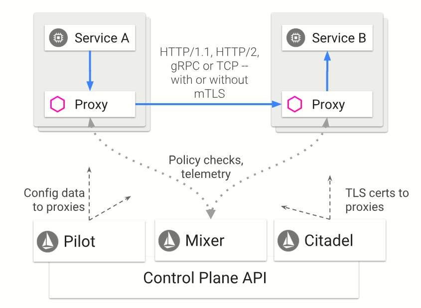

# 初识Istio


* Istio的架构分为两个平面：数据平面和控制平面。
```
数据平面：
数据平面由一组 sidecar 的代理（Envoy）组成。这些代理调解和控制微服务之间的所有网络通信，并且与控制平面的 Mixer 通讯，接受调度策略。

控制平面：
控制平面通过管理和配置 Envoy 来管理流量。此外，控制平面配置 Mixers来实施路由策略并收集检测到的监控数据
```
## 各个组件功能
1. Envoy
```
Envoy 是一个用 C ++开发的高性能代理，用于管理 Service Mesh 中所有服务的所有入站和出站流量。
Envoy内置功能：
1. 动态服务发现
2. 负载均衡
3. TLS 终止
4. HTTP / 2 和 gRPC 代理
5. 断路器
6. 健康检查
7. 流量分割
8. 故障注入
9. 监控指标

而使用 Istio 的时候，需要在 pod 中主容器旁注入一个 sidecar，也就是上面提到的代理（Envoy）。
```
2. Mixer
```
Mixer 是一个独立于平台的组件，负责在整个 Service Mesh 中执行访问控制和使用策略，并从 Envoy 代理和其他服务收集监控到的数据。
```
3. Pilot
```
Pilot 为 Envoy 提供服务发现；为高级路由（例如，A / B 测试，金丝雀部署等）提供流量管理功能；以及异常控制，如：超时，重试，断路器等。
```
4. Citadel
```
Citadel 通过内置身份和凭证管理，提供强大的服务到服务和最终用户身份验证。我们可以使用 Citadel 升级 Service Mesh 中的未加密流量。我们可以使用 Istio 的授权功能来控制谁可以访问服务。
```
