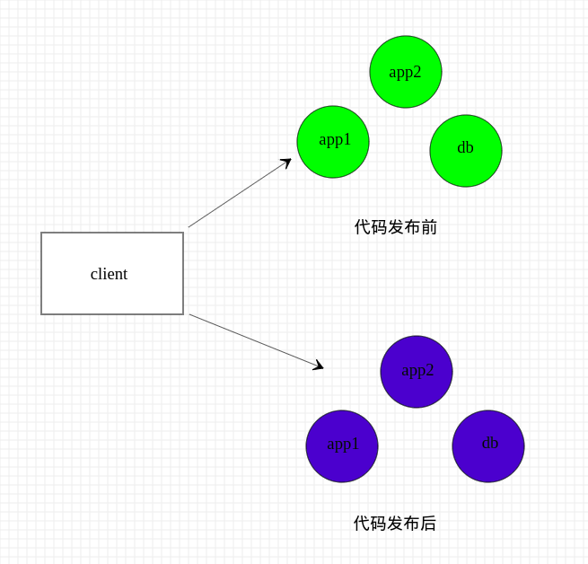

# 灰度发布

```
1、什么是灰度发布?
灰度发布（又名金丝雀发布）是指在黑与白之间，能够平滑过渡的一种发布方式。在其上可以进行A/B testing，即让一部分用户继续用产品特性A，一部分用户开始用产品特性B，如果用户对B没有什么反对意见，那么逐步扩大范围，把所有用户都迁移到B上面来。灰度发布可以保证整体系统的稳定，在初始灰度的时候就可以发现、调整问题，以保证其影响度。核心就是逐渐调整产品A和产品B的权重。

灰度发布常见一般有三种方式:

1、Nginx+LUA方式
2、根据Cookie实现灰度发布
3、根据来路IP实现灰度发布
```
### nginx根据cookie和ip实现灰度发布
1. Nginx根据来路cookie实现灰度发布
```
upstream hilinux_01 {
    server 192.168.1.100:8080 max_fails=1 fail_timeout=60;
}

upstream hilinux_02 {
    server 192.168.1.200:8080 max_fails=1 fail_timeout=60;
}

upstream default {
    server 192.168.1.100:8080 max_fails=1 fail_timeout=60;
}

server {
  listen 80;
  server_name  www.hi-linux.com;
  access_log  logs/www.hi-linux.com.log  main;

  #match cookie
  set $group "default";
    if ($http_cookie ~* "version=V1"){
        set $group hilinux_01;
    }

    if ($http_cookie ~* "version=V2"){
        set $group hilinux_02;
    }

  location / {                       
    proxy_pass http://$group;
    proxy_set_header   Host             $host;
    proxy_set_header   X-Real-IP        $remote_addr;
    proxy_set_header   X-Forwarded-For $proxy_add_x_forwarded_for;
    index  index.html index.htm;
  }
 }


在Nginx里面配置一个映射，$COOKIE_version可以解析出Cookie里面的version字段。$group是一个变量，{}里面是映射规则。

如果一个version为V1的用户来访问，$group就等于hilinux_01。在server里面使用就会代理到http://hilinux_01上。version为V2的用户来访问，$group就等于hilinux_02。在server里面使用就会代理到http://hilinux_02上。Cookie值都不匹配的情况下默认走hilinux_01所对应的服务器。

upstream hilinux_01 {
    server 192.168.1.100:8080 max_fails=1 fail_timeout=60;
}

upstream hilinux_02 {
    server 192.168.1.200:8080 max_fails=1 fail_timeout=60;
}

upstream default {
    server 192.168.1.100:8080 max_fails=1 fail_timeout=60;
}


map $COOKIE_version $group {
~*V1$ hilinux_01;
~*V2$ hilinux_02;
default default;
}

server {
  listen 80;
  server_name  www.hi-linux.com;
  access_log  logs/www.hi-linux.com.log  main;

  location / {                       
    proxy_pass http://$group;
    proxy_set_header   Host             $host;
    proxy_set_header   X-Real-IP        $remote_addr;
    proxy_set_header   X-Forwarded-For $proxy_add_x_forwarded_for;
    index  index.html index.htm;
  }
 }

```
2. Nginx根据来路IP实现灰度发布
    > 如果是内部IP，则反向代理到hilinux_02(预发布环境)；如果不是则反向代理到hilinux_01(生产环境)。
```
upstream hilinux_01 {
    server 192.168.1.100:8080 max_fails=1 fail_timeout=60;
}

upstream hilinux_02 {
    server 192.168.1.200:8080 max_fails=1 fail_timeout=60;
}

upstream default {
    server 192.168.1.100:8080 max_fails=1 fail_timeout=60;
}

server {
  listen 80;
  server_name  www.hi-linux.com;
  access_log  logs/www.hi-linux.com.log  main;


  set $group default;
  if ($remote_addr ~ "211.118.119.11") {
      set $group hilinux_02;
  }

location / {                       
    proxy_pass http://$group;
    proxy_set_header   Host             $host;
    proxy_set_header   X-Real-IP        $remote_addr;
    proxy_set_header   X-Forwarded-For $proxy_add_x_forwarded_for;
    index  index.html index.htm;
  }
}
```
    > 如果你只有单台服务器，可以根据不同的IP设置不同的网站根目录来达到相同的目的。
```
server {
  listen 80;
  server_name  www.hi-linux.com;
  access_log  logs/www.hi-linux.com.log  main;

  set $rootdir "/var/www/html";
    if ($remote_addr ~ "211.118.119.11") {
       set $rootdir "/var/www/test";
    }

    location / {
      root $rootdir;
    }
}
```


# 蓝绿发布

```
蓝绿部署是不停老版本，部署新版本然后进行测试，确认OK，将流量切到新版本，然后老版本同时也升级到新版本。
蓝绿部署无需停机，并且风险较小。

```
# 金丝雀发布

```
１、准备好部署各个阶段的工件，包括：构建工件，测试脚本，配置文件和部署清单文件
２、从负载均衡列表中移除掉“金丝雀”服务器。
３、升级“金丝雀”应用（排掉原有流量并进行部署）。
４、对应用进行自动化测试。
５、将“金丝雀”服务器重新添加到负载均衡列表中（连通性和健康检查）。
６、如果“金丝雀”在线使用测试成功，升级剩余的其他服务器。（否则就回滚）


```
