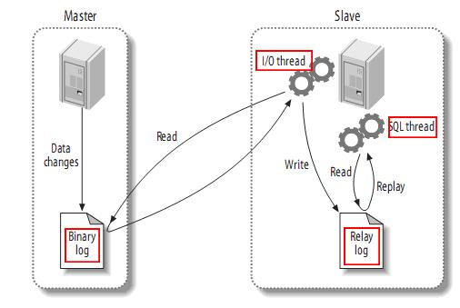

# 主从复制
## 
* 主从复制的过程
1. master将改变记录到二进制日志(binary log)中（这些记录叫做二进制日志事件，binary log events）；

2. slave将master的binary log events拷贝到它的中继日志(relay log)；

3. slave重做中继日志中的事件，将改变反映它自己的数据。

## 主从复制的目的和架构
1. Master/Slave（主/从）
    > Master: write/read

    > Slaves: read

2. 主从复制的目的
* 冗余：promte（提升为主），异地灾备
* 负载均衡：转移一部分“读”请求；
* 支援安全的备份操作；
* 日常测试；

3. 复制的方式：
* ☉同步复制：
    > 所谓的同步复制，意思是master的变化，必须等待slave-1,slave-2,...,slave-n完成后才能返回。这样，显然不可取，也不是MYSQL复制的默认设置。比如，在WEB前端页面上，用户增加了条记录，需要等待很长时间。
* ☉异步复制：
    > master只需要完成自己的数据库操作即可。至于slaves是否收到二进制日志，是否完成操作，不用关心。MYSQL的默认设置。
* ☉半同步复制：
    > master只保证slaves中的一个操作成功，就返回，其他slave不管。这个功能，是由google为MYSQL引入的。

* 常识部分
    > 常见的备份方法：mysqldump　、　xtrabackup(热备份)

    > mysqldump命令适用于对数据库相对较小的MySQL进行备份，一般数据量约50GB以内，大于50GB强烈建议使用xtrabackup工具。

    > mysqldump备份，如果有插入、修改操作，必然会锁表，可加入--skip-opt参数解决,或者选择在深夜访问少的时候。
