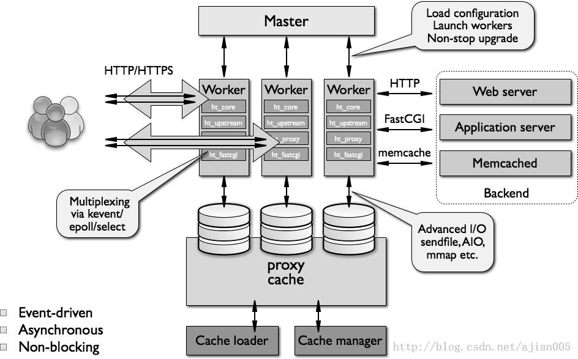

# 总结一些常见的nginx相关的问题
***
* nginx架构图
## 

* nginx的功用
1. 结合FastCGI/uwSGI/SCGI等协议反代动态资源请求；(也可以缓存动态资源)
2. http/https协议的反向代理；
3. imap4/pop3协议的反抽代理；
4. tcp/udp协议的反代；
5. 静态的web资源服务器；

* nginx启动时，会启动两个进程： 一个是Master进程(主进程)和worker进程(工作进程)
    > master负责加载配置文件、管理worker进程、平滑升级
    > worker处理并响应用户请求

# 简述nginx reload的过程

## 
* 原理：
    > nginx -s reload的过程：服务不会中断。

    > 原来的连接不变，等他关闭了连接自动消失。reload之后会产生新的线程带着新读取的配置文件内容来响应请求，连接数较多的时候建议等访问少的时候进行reload。
