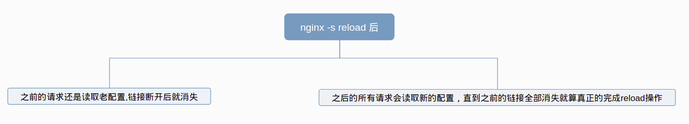

# 总结一些常见的nginx相关的问题
***

* nginx启动时，会启动两个进程： 一个是Master进程(主进程)和worker进程(工作进程)

# nginx的工作模型

# 简述nginx reload的过程

## 
* 原理：
    > nginx -s reload的过程：服务不会中断。
    > 原来的连接不变，等他关闭了连接自动消失。reload之后会产生新的线程带着新读取的配置文件内容来响应请求，连接数较多的时候建议等访问少的时候进行reload。
