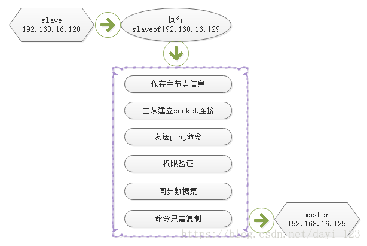
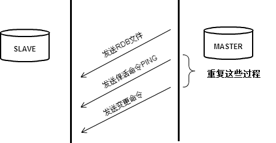
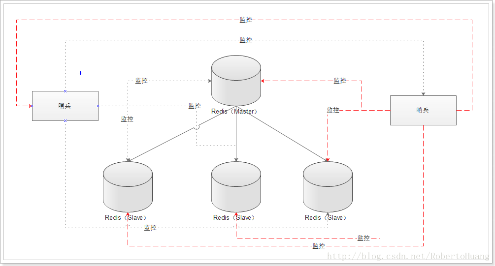

# redis基础
### 1、Redis与其他 key-value缓存产品的特点：
1. Redis支持数据的持久化，可以将内存中的数据保存在磁盘中，重启的时候可以再次加载进行使用。
2. Redis不仅仅支持简单的key-value类型的数据，同时还提供list，set，zset，hash等数据结构的存储。
3. Redis支持数据的备份，即master-slave模式的数据备份。

### 2、主从复制
## 
## 
* **说明**
* 一个Master可以有多个Slave；
* 支持链式复制
* Master以非阻塞方式同步数据至Slave
    > 当Slave连接或者重连到Master后，Slave会发出一个sync命令，Master会把数据、新的插入或修改操作写入磁盘(rdb快照)，然后Master会把快照文件传送给Slave,Slave执行这些命令实现和Master的同步。

### 3、发布与订阅
* pub/sub
    > Redis发布订阅(pub/sub)是一种消息通信模式：发送者(pub)发送消息，订阅者(sub)接收消息。

    >Redis客户端可以订阅任意数量的频道。

### 4、redis的持久化：RDB和AOF
* ☉RDB
    > snapshot（快照），二进制格式；按事先定制的策略，周期性的将数据保存至磁盘；数据文件默认为dump.rdb。

* ☉AOF(redis2.4之后的版本默认启用)
    > 记录每一次写操作至指定的文件尾部实现持久化（类似MySQL的binlog）；当redis重启时，可通过重新执行文件中的命令在内存中重建数据库。

**注意：持久本身不能取代备份,还应该指定备份策略，对redis数据库定期进行备份**    

### 5、Redis的sentinel机制(哨兵机制)
* 哨兵机制集群拓扑图
## 
**多个哨兵,不仅同时监控主从数据库,而且哨兵之间互为监控**

* FQA:
1. 为什么要用到哨兵?
    > 哨兵(Sentinel)主要是为了解决在主从复制架构中出现宕机的情况,主要分为两种情况:

* 1.1 从Redis宕机
    > 这个相对而言比较简单,在Redis中从库重新启动后会自动加入到主从架构中,自动完成同步数据。在Redis2.8版本后,主从断线后恢复的情况下实现增量复制。
* 1.2 主Redis宕机
    > 这个相对而言就会复杂一些,需要以下2步才能完成

    > i.第一步,在从数据库中执行SLAVEOF NO ONE命令,断开主从关系并且提升为主库继续服务

    > ii.第二步,将主库重新启动后,执行SLAVEOF命令,将其设置为其他库的从库,这时数据就能更新回来

 * 由于这个手动完成恢复的过程其实是比较麻烦的并且容易出错,所以Redis提供的哨兵(sentinel)的功能来解决

2. 哨兵的作用
    > 1.监控(Monitoring):Sentinel会不断地检查你的主服务器和从服务器是否运作正常

    > 2.提醒(Notification):当被监控的某个Redis服务器出现问题时,Sentinel可以通过API向管理员或者其他应用程序发送通知

    > 3.自动故障迁移(Automatic failover):当一个主服务器不能正常工作时,Sentinel 会开始一次自动故障迁移操作,它会将失效主服务器的其中一个从服务器升级为新的主服务器,并让失效主服务器的其他从服务器改为复制新的主服务器;当客户端试图连接失效的主服务器时,集群也会向客户端返回新主服务器的地址,使得集群可以使用新主服务器代替失效服务器
