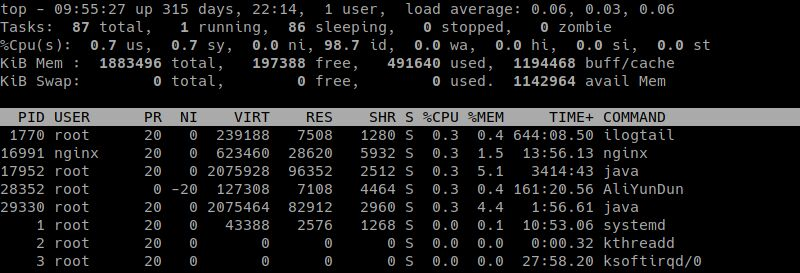

# top常用命令


1. 第1行：Top 任务队列信息(系统运行状态及平均负载)，与uptime命令结果相同
```
第1段：系统当前时间，例如：16:07:37
第2段：系统运行时间，未重启的时间，时间越长系统越稳定。 格式：up xx days, HH:MM。例如：5 days, 17:54, 表示连续运行了5天17小时54分钟
第3段：当前登录用户数，例如：1 user，表示当前只有1个用户登录
第4段：系统负载，即任务队列的平均长度，3个数值分别统计最近1，5，15分钟的系统平均负载
    系统平均负载：单核CPU情况下，0.00 表示没有任何负荷，1.00表示刚好满负荷，超过1侧表示超负荷，理想值是0.7；
    多核CPU负载：CPU核数 * 理想值0.7 = 理想负荷，例如：4核CPU负载不超过2.8何表示没有出现高负载
```
2. 第2行：Tasks 进程相关信息
```
第1段：进程总数，例如：Tasks: 121 total，表示总共运行121个进程
第2段：正在运行的进程数，例如：1 running，表示正在运行1个进程
第3段：睡眠的进程数，例如：120 sleeping，表示120个睡眠进程
第4段：停止的进程数，例如：0 stopped，表示0个stop进程
第5段：僵尸进程数，例如：0 zombie，表示0个僵尸进程
```
3. 第3行：Cpus CPU相关信息，如果是多核CPU，按数字1可显示各核CPU信息，此时1行将转为Cpu核数行，数字1可以来回切换
```
第1段：us 用户空间占用CPU百分比，例如：Cpu(s): 0.3% us
第2段：sy 内核空间占用CPU百分比，例如：0.3% sy
第3段：ni 用户进程空间内改变过优先级的进程占用CPU百分比，例如：0.0%ni,
第4段：id 空闲CPU百分比，例如：99.3 %id
第5段：wa 等待输入输出的CPU时间百分比，例如：0.0%wa
第6段：hi CPU服务于硬件中断所耗费的时间总额，例如：0.0%hi
第7段：si CPU服务软中断所耗费的时间总额，例如：0.0%si
第8段：st Steal time 虚拟机被hypervisor偷去的CPU时间（如果当前处于一个hypervisor下的vm，实际上hypervisor也是要消耗一部分CPU处理时间的）
```
4. 第4行：Mem 内存相关信息
```
第1段：物理内存总量，例如：Mem:1882736 total
第2段：使用的物理内存总量，例如：82100 used
第3段：空闲内存总量，例如：Mem:1013200 free
第4段：用作内核缓存的内存量，例如：787436 buffers
```

    > 查看具体某个进程资源消耗：top -p pid
