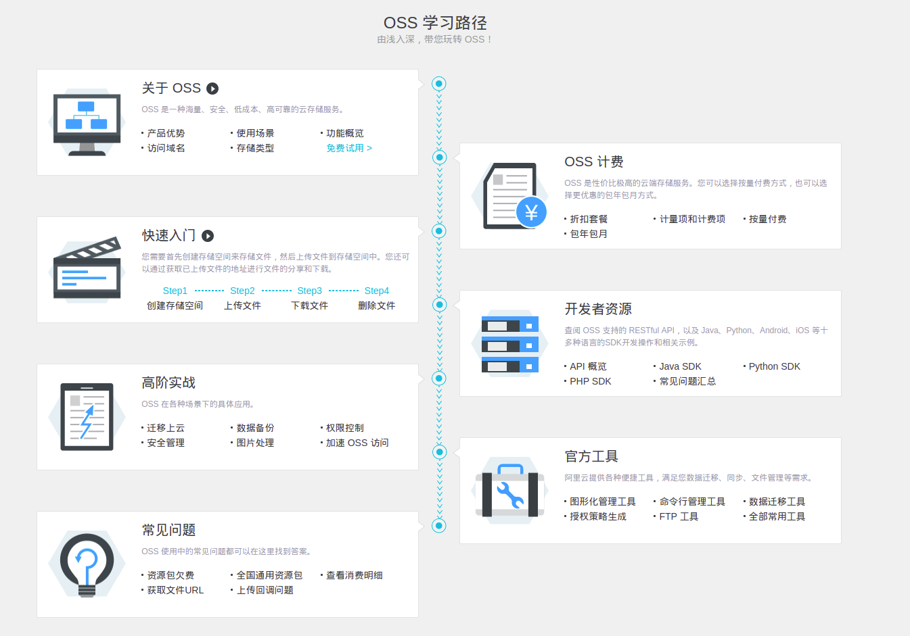
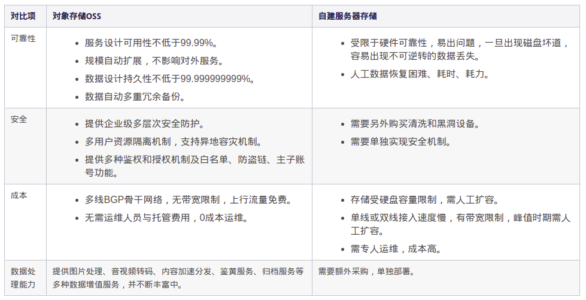
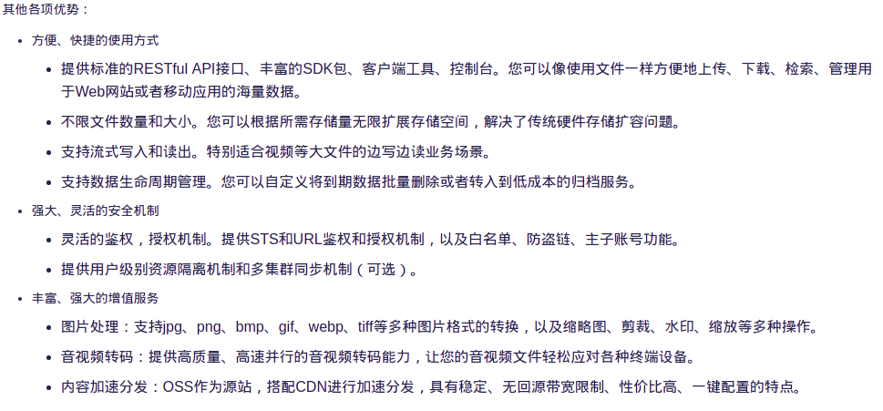

# 对象存储OSS
## 
## 什么是OSS?
    > 阿里云对象存储服务（Object Storage Service，简称OSS），是阿里云对外提供的海量、安全、低成本、高可靠的云存储服务。您可以通过本文档提供的简单的REST接口，在任何时间、任何地点、任何互联网设备上进行上传和下载数据。基于OSS，您可以搭建出各种多媒体分享网站、网盘、个人和企业数据备份等基于大规模数据的服务。
* 优势
## 
## 

## 基础概念
    > 存储类型：OSS提供标准、低频访问、归档三种存储类型，根据访问频率、保存周期的不同选择不同的类型。

    > 储存空间(Bucket):存储数据的主目录，可以设置和修改存储空间属性用来控制地域、访问权限、生命周期等

    >　对象/文件（Object）：对象是OSS存储数据的基本单元，也被称为OSS的文件。对象由元信息（Object Meta）、用户数据（Data）和文件名（Key）组成。

    >　地域（Region）：地域表示OSS的数据中心所在物理位置。可以根据费用、请求来源等综合选择数据存储的地域。

    > 访问域名（Endpoint）:Endpoint表示OSS对外服务的访问域名。OSS以HTTP RESTful API的形式对外提供服务，当访问不同地域的时候，需要不同的域名。通过内网和外网访问同一个地域所需要的域名也是不同的。

    > 访问密钥（AccessKey）:AccessKey，简称AK，指的是访问身份验证中用到的AccessKeyId 和AccessKeySecret。OSS通过使用 AccessKeyId 和 AccessKeySecret 对称加密的方法来验证某个请求的发送者身份。  

##

##

##

##
